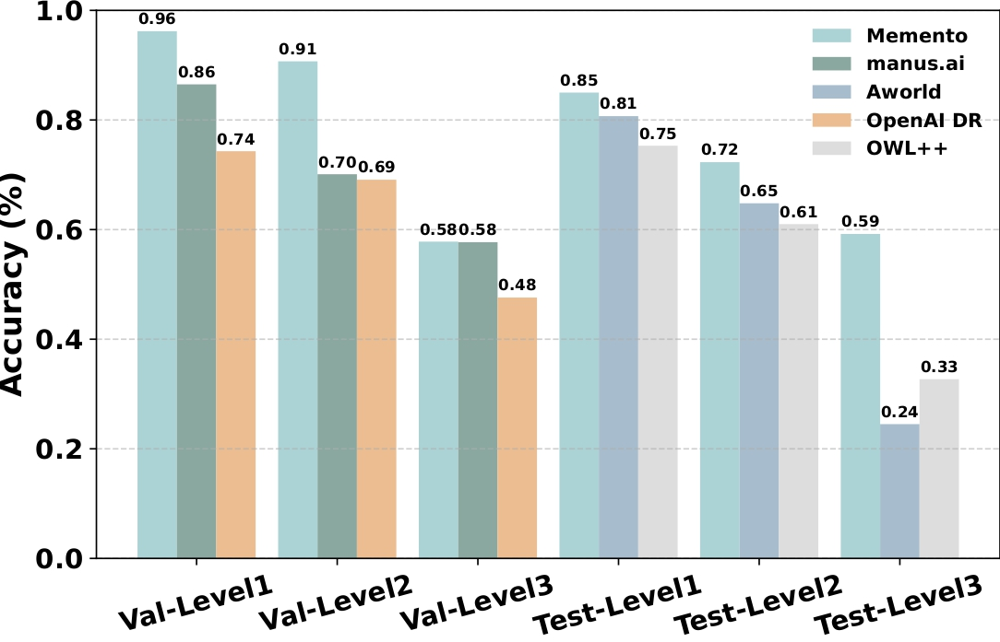
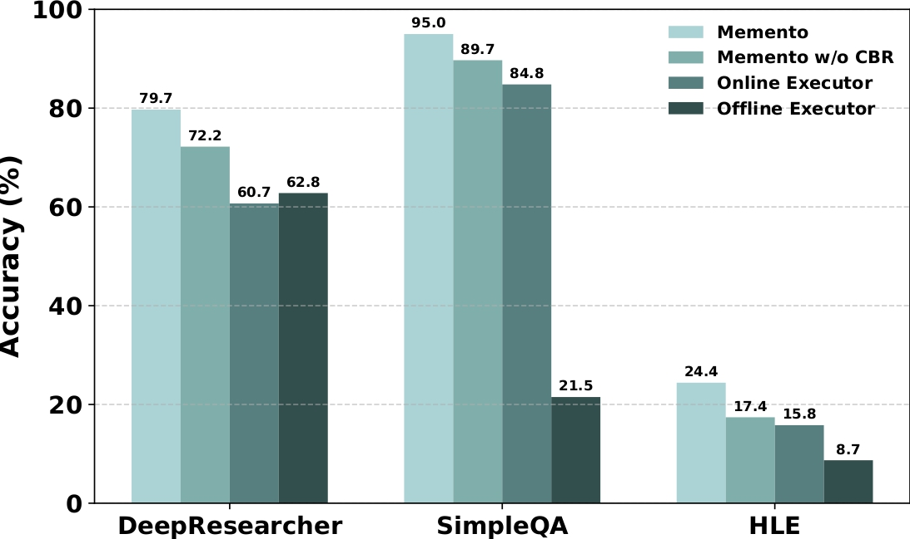
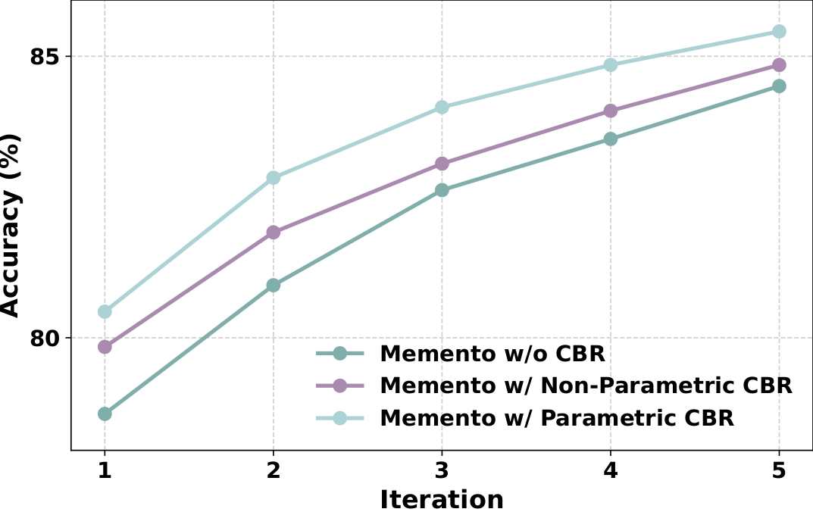
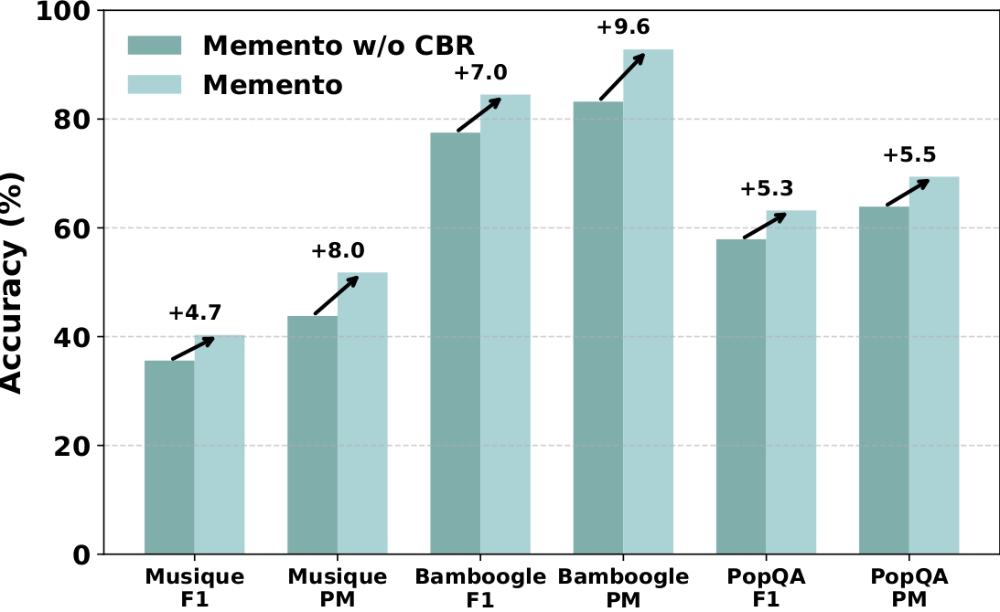

# Memento: Fine-tuning LLM Agents **without** Fine-tuning LLMs

> A memory-based, continual-learning framework that helps LLM agents improve from experience **without** updating model weights.

<p align="center">
  <b>Planner–Executor Architecture</b> • <b>Case-Based Reasoning</b> • <b>MCP Tooling</b> • <b>Memory-Augmented Learning</b>
</p>

---

<table>
  <tr>
    <td align="center" width="50%">
      
      <br/>
      <sub><b>Memento vs. Baselines on GAIA validation and test sets.</b></sub>
    </td>
    <td align="center" width="50%">
      
      <br/>
      <sub><b>Ablation study of Memento across benchmarks.</b></sub>
    </td>
  </tr>
  <tr>
    <td align="center" width="50%">
      
      <br/>
      <sub><b>Continual learning curves across memory designs.</b></sub>
    </td>
    <td align="center" width="50%">
      
      <br/>
      <sub><b>Memento’s accuracy improvement on OOD datasets.</b></sub>
    </td>
  </tr>
</table>

## 📰 News
- [2025.08.27] Thanks for your interest in our work! We’ll release our CBR code next week and our Parametric Memory code next month. We’ll keep updating on our further development.
- [2025.08.27] We add a new Crawler MCP in ```server/ai_crawler.py``` for web crawling and query-aware content compression to reduce token cost.
- [2025.08.26] We add the SerpAPI (https://serpapi.com/search-api) MCP tool to help you avoid using the search Docker and speed up development. 

## 🔥 Key Features

- **No LLM weight updates.** Memento reframes continual learning as **memory-based online reinforcement learning** over a **memory-augmented MDP**. A neural **case-selection policy** guides actions; experiences are stored and reused via efficient Read/Write operations.
- **Two-stage planner–executor loop.** A CBR-driven **Planner** decomposes tasks and retrieves relevant cases; an **Executor** runs each subtask as an MCP client, orchestrating tools and writing back outcomes.
- **Comprehensive tool ecosystem.** Built-in support for web search, document processing, code execution, image/video analysis, and more through a unified MCP interface.
- **Strong benchmark performance.** Achieves competitive results across GAIA, DeepResearcher, SimpleQA, and HLE benchmarks.

---

## 🧠 Core Concept

**Learn from experiences, not gradients.** Memento logs successful & failed trajectories into a **Case Bank** and **retrieves by value** to steer planning and execution—enabling low-cost, transferable, and online continual learning.

---

## 🏗️ Architecture

### Core Components

- **Meta-Planner**: Breaks down high-level queries into executable subtasks using GPT-4.1
- **Executor**: Executes individual subtasks using o3 or other models via MCP tools
- **Case Memory**: Stores final-step tuples **(s_T, a_T, r_T)** for experience replay
- **MCP Tool Layer**: Unified interface for external tools and services

### Tool Ecosystem

- **Web Research**: Live search and controlled crawling via SearxNG
- **Document Processing**: Multi-format support (PDF, Office, images, audio, video)
- **Code Execution**: Sandboxed Python workspace with security controls
- **Data Analysis**: Excel processing, mathematical computations
- **Media Analysis**: Image captioning, video narration, audio transcription

---

## 🚀 Quick Start

### Prerequisites

- Python 3.10+
- OpenAI API key (or compatible API endpoint)
- SearxNG instance for web search

### Environment Setup

### Installation


```bash
# Create and activate conda environment

git clone https://github.com/Agent-on-the-Fly/Memento
cd Memento

conda create -n Memento python=3.11 -y
conda activate Memento

# Navigate to client directory
cd Memento/client

# Create environment file
touch .env
```


### Environment Variables Configuration

After creating the `.env` file, you need to configure the following API keys and service endpoints:

```bash
# OPENAI API
OPENAI_API_KEY=your_openai_api_key_here
OPENAI_BASE_URL=https://api.openai.com/v1  # or your custom endpoint

#===========================================
# Tools & Services API
#===========================================
# Chunkr API (https://chunkr.ai/)
CHUNKR_API_KEY=your_chunkr_api_key_here

# Jina API
JINA_API_KEY=your_jina_api_key_here

# ASSEMBLYAI API 
ASSEMBLYAI_API_KEY=your_assemblyai_api_key_here
```

**Note**: Replace `your_*_api_key_here` with your actual API keys. Some services are optional depending on which tools you plan to use.

### Dependencies Installation

#### Web Scraping & Search

```bash
# Web crawling and search capabilities
pip install -U crawl4ai
crawl4ai-setup
crawl4ai-doctor
playwright install
```

#### Utility Libraries

```bash
pip install -r requirements.txt
```

### SearxNG Setup

For web search capabilities, set up SearxNG: 
You can follow https://github.com/searxng/searxng-docker/ to set the docker and use our setting.

```bash
# In a new terminal
cd ./Memento/searxng-docker
docker compose up -d
```


### Basic Usage

#### Interactive Mode

```bash
python client/agent.py
```

---

## 🔧 Configuration

### Model Selection

- **Planner Model**: Defaults to `gpt-4.1` for task decomposition
- **Executor Model**: Defaults to `o3` for task execution
- **Custom Models**: Support for any OpenAI-compatible API

### Tool Configuration

- **Search**: Configure SearxNG instance URL
- **Code Execution**: Customize import whitelist and security settings
- **Document Processing**: Set cache directories and processing limits

---

## 📊 Performance

### Benchmark Results

- **GAIA**: 87.88% (Val, Pass@3 Top-1) and **79.40%** (Test)
- **DeepResearcher**: **66.6% F1 / 80.4% PM**, with **+4.7–9.6** absolute gains on OOD datasets
- **SimpleQA**: **95.0%**
- **HLE**: **24.4% PM** (close to GPT-5 at 25.32%)

### Key Insights

- **Small, high-quality memory works best**: Retrieval **K=4** yields peak F1/PM
- **Planning + CBR consistently improves performance**
- **Concise, structured planning outperforms verbose deliberation**

---

## 🛠️ Development

### Project Structure

```
Memento/
├── client/                 # Main agent implementation
│   └── agent.py          # Hierarchical client with planner-executor
├── server/                # MCP tool servers
│   ├── code_agent.py     # Code execution and workspace management
│   ├── search_tool.py    # Web search via SearxNG
│   ├── documents_tool.py # Multi-format document processing
│   ├── image_tool.py     # Image analysis and captioning
│   ├── video_tool.py     # Video processing and narration
│   ├── excel_tool.py     # Spreadsheet processing
│   ├── math_tool.py      # Mathematical computations
│   └── craw_page.py      # Web page crawling
└── interpreters/          # Code execution backends
    ├── docker_interpreter.py
    ├── e2b_interpreter.py
    ├── internal_python_interpreter.py
    └── subprocess_interpreter.py
```

### Adding New Tools

1. Create a new FastMCP server in the `server/` directory
2. Implement your tool functions with proper error handling
3. Register the tool with the MCP protocol
4. Update the client's server list in `agent.py`

### Custom Interpreters

Extend the `interpreters/` module to add new execution backends:

```python
from interpreters.base import BaseInterpreter

class CustomInterpreter(BaseInterpreter):
    async def execute(self, code: str) -> str:
        # Your custom execution logic
        pass
```

---

## 📋 TODO

### Upcoming Features & Improvements

- [ ] **Add Case Bank Reasoning**: Implement memory-based case retrieval and reasoning system
- [ ] **Add User Personal Memory Mechanism**: Implement user-preference search 
- [ ] **Refine Tools & Add More Tools**: Enhance existing tools and expand the tool ecosystem
- [ ] **Test More New Benchmarks**: Evaluate performance on additional benchmark datasets

---

### Limitations

- **Long-horizon tasks**: GAIA Level-3 remains challenging due to compounding errors
- **Frontier knowledge**: HLE performance limited by tooling alone
- **Open-source coverage**: Limited executor validation in fully open pipelines

---

## 🙏 Acknowledgement

* Some parts of the code in the toolkits and interpreters are adapted from [Camel-AI](https://github.com/camel-ai/camel).

---

## 📚 Citation

If Memento helps your work, please cite:

```bibtex
@techreport{Memento2025,
  title        = {Memento: Fine-tuning LLM Agents without Fine-tuning LLMs},
  author       = {Huichi Zhou and Yihang Chen and Siyuan Guo and Xue Yan and
                  Kin Hei Lee and Zihan Wang and Ka Yiu Lee and Guchun Zhang and
                  Kun Shao and Linyi Yang and Jun Wang},
  year         = {2025},
  github       = {https://github.com/Agent-on-the-Fly/Memento}
}
```

---

## 🤝 Contributing

We welcome contributions! Please see our contributing guidelines for:

- Bug reports and feature requests
- Code contributions and pull requests
- Documentation improvements
- Tool and interpreter extensions

---

## Star History

[](https://www.star-history.com/#Agent-on-the-Fly/Memento&Date)

## 🙏 Acknowledgments

Thanks to the open-source community and contributors who made this project possible.
