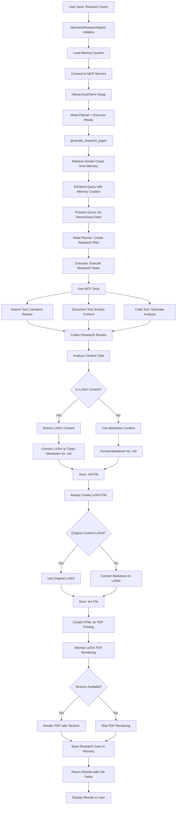
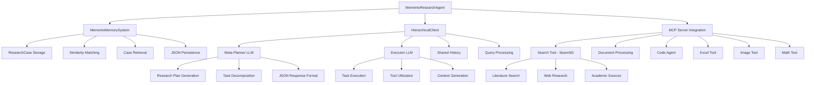
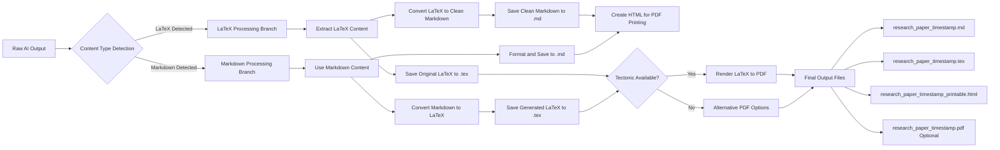
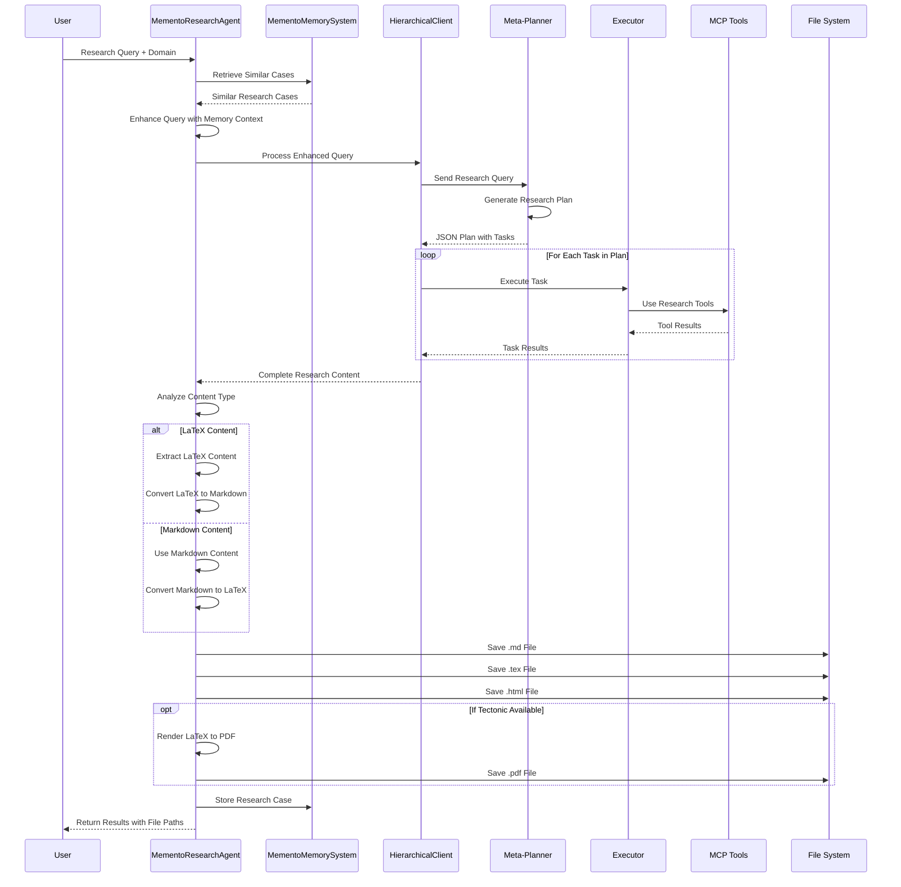

# Memento Library Research Agent - Complete Workflow Documentation

## Overview

The `memento_library_research_agent.py` is a sophisticated research paper generation system that leverages Memento's hierarchical agent architecture combined with Model Context Protocol (MCP) tools to create comprehensive academic research papers. This document provides a complete workflow analysis with detailed Mermaid diagrams.

## Architecture Components

### Core Components

1. **MementoResearchAgent**: Main orchestrator class
2. **MementoMemorySystem**: Handles case-based learning and retrieval
3. **HierarchicalClient**: Memento's meta-planner + executor architecture
4. **MCP Tools Integration**: Search, document processing, and other research tools
5. **Multi-format Output System**: Generates `.md`, `.tex`, `.html`, and `.pdf` files

## Complete System Workflow



## Detailed Component Architecture



## Multi-Format Output Processing



## Sequence Diagram: Complete Research Process



## Core Classes and Functions

### 1. MementoResearchAgent Class

**Purpose**: Main orchestrator for research paper generation

**Key Methods**:
- `__init__()`: Initialize with configurable LLM models (default: o3-mini)
- `initialize()`: Connect to MCP servers and setup tools
- `generate_research_paper()`: Core research generation workflow
- `interactive_research_session()`: Interactive CLI interface
- `cleanup()`: Proper resource cleanup

**Configuration**:
- **meta_model**: Model for planning (default: "o3-mini")
- **exec_model**: Model for execution (default: "o3-mini")
- **server_scripts**: MCP tools to connect (default: search_tool.py)

### 2. MementoMemorySystem Class

**Purpose**: Case-based learning and memory retrieval

**Key Methods**:
- `store_case()`: Store completed research cases
- `retrieve_similar_cases()`: Find relevant past research
- `calculate_similarity()`: Compute case similarity scores
- `load_cases()` / `save_cases()`: Persistence management

**Data Structure**:
```python
@dataclass
class ResearchCase:
    query: str
    domain: str
    approach: str
    tools_used: List[str]
    success_metrics: Dict[str, float]
    insights: List[str]
    timestamp: datetime
    task_complexity: int
    final_result: str
```

### 3. Content Processing Pipeline

**LaTeX to Markdown Conversion**:
- Extract content between `\begin{document}` and `\end{document}`
- Convert sections: `\section{}` → `## Header`
- Convert formatting: `\textbf{}` → `**bold**`
- Handle equations, citations, and references
- Clean up LaTeX commands and syntax

**Markdown to LaTeX Conversion**:
- Add LaTeX document structure
- Convert headers to LaTeX sections
- Handle lists, formatting, and special characters
- Generate proper academic paper structure

## File Output System

The agent **always** generates exactly 4 files for each research paper:

### Core Files (Always Generated)

1. **`.md` File**: Clean, readable markdown
   - Converted from LaTeX if needed
   - Human-readable format
   - Contains all research content

2. **`.tex` File**: LaTeX source code
   - Original LaTeX if AI generated it
   - Converted from markdown if needed
   - Ready for LaTeX compilation

3. **`.html` File**: PDF-ready HTML
   - Styled for browser printing
   - Ctrl+P → Save as PDF workflow
   - Fallback PDF generation method

### Optional File

4. **`.pdf` File**: Compiled PDF (if Tectonic available)
   - Professional publication format
   - Requires Tectonic LaTeX engine
   - Automatic generation when possible

## Memory and Learning System

### Case Storage Format
```json
{
  "query": "Research topic",
  "domain": "Field of study", 
  "approach": "hierarchical_memento",
  "tools_used": ["search", "document_processing"],
  "success_metrics": {
    "completion_score": 0.8,
    "tools_utilization": 0.6,
    "content_length": 0.9,
    "academic_quality": 0.8
  },
  "insights": ["Research gaps identified", "Novel contributions"],
  "timestamp": "2025-01-31T16:40:00",
  "task_complexity": 250,
  "final_result": "First 500 characters of result..."
}
```

### Similarity Matching Algorithm
- **Query similarity**: Cosine similarity of terms
- **Domain matching**: Exact domain match bonus
- **Temporal relevance**: Recent cases weighted higher
- **Success bias**: Higher success scores preferred

## MCP Tools Integration

### Search Tool (SearxNG)
- **Purpose**: Literature search and web research
- **Endpoint**: Local SearxNG instance (localhost:8080)
- **Features**: Privacy-respecting metasearch
- **Usage**: Academic paper discovery, fact verification

### Document Processing Tool
- **Purpose**: Extract and analyze PDFs/documents
- **Features**: Text extraction, content analysis
- **Integration**: Planned for future versions

### Code Agent Tool
- **Purpose**: Generate code, analysis scripts
- **Features**: Data analysis, visualization
- **Integration**: Planned for future versions

## LLM Model Configuration

### Current Setup (O3 Model)
- **Meta-Planner**: Uses OpenAI O3-mini via `responses.create()`
- **Executor**: Uses OpenAI O3-mini via `responses.create()`
- **API**: OpenAI API with special O3 handling
- **Fallback**: GROQ models (llama-3.3-70b-versatile)

### Model Selection Logic
```python
if "o3" in model_name:
    # Use OpenAI API with responses.create()
    api_key = os.getenv("OPENAI_API_KEY")
    client = AsyncOpenAI(api_key=api_key)
    response = await client.responses.create(model=model, input=messages)
else:
    # Use standard chat completions
    response = await client.chat.completions.create(model=model, messages=messages)
```

## Error Handling and Recovery

### Common Issues and Solutions

1. **Missing API Keys**
   - **Error**: HTTP 401 Unauthorized
   - **Solution**: Check `.env` file for `OPENAI_API_KEY` or `GROQ_API_KEY`

2. **SearxNG Not Running**
   - **Error**: Connection refused to localhost:8080
   - **Solution**: Start Docker container with `docker-compose up -d`

3. **Model Not Available**
   - **Error**: HTTP 404 model not found
   - **Solution**: Switch to available model or check API provider

4. **Tectonic PDF Generation Fails**
   - **Error**: Network connectivity issues
   - **Solution**: Use HTML→PDF browser printing fallback

### Graceful Degradation
- PDF generation failures don't stop the process
- Missing tools are logged but don't crash the system
- Memory system continues even if case loading fails
- Alternative output formats provided when primary fails

## Performance Characteristics

### Typical Execution Times
- **Initialization**: 2-5 seconds (MCP server connection)
- **Research Generation**: 30-120 seconds (depends on complexity)
- **File Processing**: 1-3 seconds (format conversions)
- **PDF Rendering**: 5-15 seconds (if Tectonic works)

### Resource Usage
- **Memory**: ~200-500MB (depends on research content)
- **Storage**: ~10-50KB per research paper set
- **Network**: Variable (depends on search tool usage)

## Future Enhancements

### Planned Features
1. **Enhanced Tool Integration**: Document processing, image analysis
2. **Advanced Memory**: Semantic similarity, learning from feedback
3. **Quality Metrics**: Automated paper quality assessment
4. **Collaboration**: Multi-agent research teams
5. **Templates**: Domain-specific paper templates

### Extension Points
- **Custom MCP Tools**: Add domain-specific research tools
- **Model Adapters**: Support additional LLM providers
- **Output Formats**: Add more export formats (Word, PowerPoint)
- **Quality Filters**: Content validation and improvement

## Usage Examples

### Basic Usage
```python
agent = MementoResearchAgent()
await agent.initialize()

result = await agent.generate_research_paper(
    "Mixture of Agents for Enhanced Reasoning",
    domain="artificial intelligence"
)

print(f"Generated: {result['result_file']}")
```

### Custom Model Configuration
```python
agent = MementoResearchAgent(
    meta_model="llama-3.3-70b-versatile",
    exec_model="llama-3.3-70b-versatile"
)
```

### Interactive Session
```python
await agent.interactive_research_session()
# Provides CLI interface for research topics
```

## Conclusion

The Memento Library Research Agent represents a sophisticated integration of:
- **Hierarchical AI Architecture**: Meta-planning + execution
- **Memory-Based Learning**: Case storage and retrieval
- **Tool Integration**: MCP-based research capabilities
- **Multi-Format Output**: Professional document generation
- **Robust Error Handling**: Graceful degradation and recovery

This system demonstrates how modern AI agents can be built with proper architectural patterns, memory systems, and tool integration to create practical, production-ready research automation tools.

