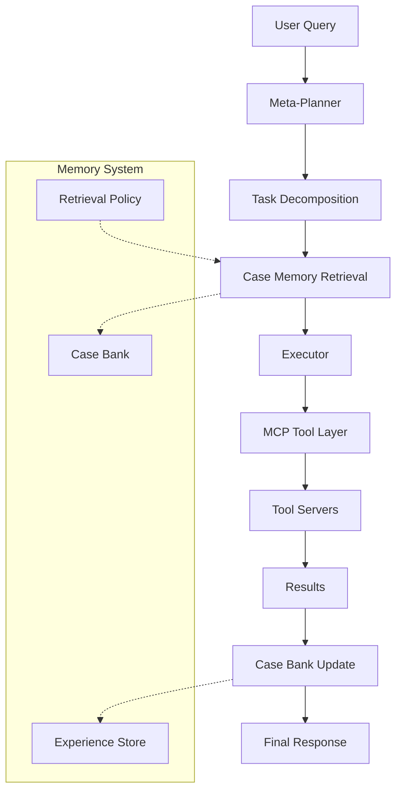
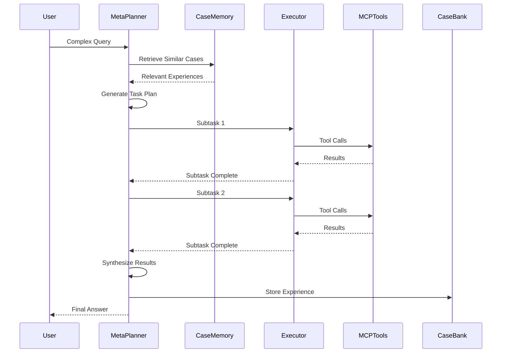

# Memento: Complete Tutorial and Architecture Guide

## Table of Contents
1. [Overview and Core Concepts](#overview-and-core-concepts)
2. [Architecture Deep Dive](#architecture-deep-dive)
3. [Installation and Setup](#installation-and-setup)
4. [Workflow Process](#workflow-process)
5. [Component Analysis](#component-analysis)
6. [Practical Examples](#practical-examples)
7. [Advanced Configuration](#advanced-configuration)
8. [Troubleshooting](#troubleshooting)

---

## Overview and Core Concepts

### What is Memento?

Memento is a revolutionary framework that enables **continual learning for LLM agents without updating model weights**. Instead of traditional fine-tuning, it uses:

- **Memory-Based Learning**: Stores experiences in a "Case Bank" for future reference
- **Case-Based Reasoning (CBR)**: Retrieves relevant past experiences to guide current decisions
- **Planner-Executor Architecture**: Separates high-level planning from task execution
- **MCP (Model Context Protocol) Tooling**: Unified interface for external tools and services

### Key Innovation: Learning from Experiences, Not Gradients

Traditional AI training requires:
- Large datasets
- Expensive GPU compute
- Model weight updates
- Risk of catastrophic forgetting

Memento instead:
- Logs successful and failed trajectories
- Retrieves similar cases by value
- Guides planning and execution through memory
- Enables low-cost, transferable learning

---

## Architecture Deep Dive

### Core Components



### 1. Meta-Planner
- **Model**: GPT-4.1 (configurable)
- **Function**: Breaks down high-level queries into executable subtasks
- **Output**: JSON plan with sequential tasks
- **Memory Integration**: Retrieves relevant past cases to inform planning

### 2. Executor
- **Model**: o3 (configurable)
- **Function**: Executes individual subtasks using MCP tools
- **Capabilities**: Function calling, tool orchestration, result synthesis
- **Memory Integration**: Records execution outcomes for future reference

### 3. Case Memory System
- **Storage**: Final-step tuples (s_T, a_T, r_T)
- **Retrieval**: K=4 optimal for most tasks
- **Update**: Online learning from each interaction
- **Structure**: Organized by task similarity and success patterns

### 4. MCP Tool Layer
Unified interface providing:
- **Web Research**: Live search via SearxNG
- **Document Processing**: PDF, Office, images, audio, video
- **Code Execution**: Sandboxed Python workspace
- **Data Analysis**: Excel, mathematical computations
- **Media Analysis**: Image captioning, video narration

---

## Installation and Setup

### Prerequisites
- Python 3.10+
- Docker (for SearxNG)
- OpenAI API key or compatible endpoint

### Step 1: Environment Setup

```bash
# Clone the repository
git clone https://github.com/Agent-on-the-Fly/Memento.git
cd Memento

# Create conda environment
conda create -n Memento python=3.11 -y
conda activate Memento
```

### Step 2: Install Dependencies

```bash
# Core dependencies
pip install -r requirements.txt

# Web crawling capabilities
pip install -U crawl4ai
crawl4ai-setup
crawl4ai-doctor
playwright install
```

### Step 3: Configure Environment Variables

Create `.env` file in the `client/` directory:

```bash
# OpenAI Configuration
OPENAI_API_KEY=your_openai_api_key_here
OPENAI_BASE_URL=https://api.openai.com/v1

# Optional Tool APIs
CHUNKR_API_KEY=your_chunkr_api_key_here
JINA_API_KEY=your_jina_api_key_here
ASSEMBLYAI_API_KEY=your_assemblyai_api_key_here
```

### Step 4: Setup SearxNG for Web Search

```bash
# Navigate to searxng-docker directory
cd searxng-docker

# Start SearxNG instance
docker compose up -d

# Verify it's running
curl http://localhost:8080
```

---

## Workflow Process

### High-Level Flow

1. **Query Input**: User provides a complex task or question
2. **Planning Phase**: Meta-planner decomposes into subtasks
3. **Memory Retrieval**: System searches for relevant past experiences
4. **Execution Phase**: Executor processes each subtask using appropriate tools
5. **Result Synthesis**: Combine subtask results into final answer
6. **Memory Update**: Store successful patterns for future use

### Detailed Process Flow



---

## Component Analysis

### Client Architecture (`client/agent.py`)

The main agent implements a hierarchical architecture:

```python
class HierarchicalAgent:
    def __init__(self):
        self.planner = OpenAIBackend("gpt-4.1")  # Meta-planner
        self.executor = OpenAIBackend("o3")       # Task executor
        self.mcp_sessions = {}                    # Tool connections
        
    async def process_query(self, query: str):
        # 1. Generate initial plan
        plan = await self.planner.generate_plan(query)
        
        # 2. Execute tasks sequentially
        for task in plan.tasks:
            result = await self.executor.execute_task(task)
            plan.update_with_result(result)
            
        # 3. Generate final answer
        return await self.planner.synthesize_answer(plan)
```

### Server Tools (`server/`)

Each tool server implements specific functionality:

#### Code Execution (`code_agent.py`)
- **Workspace Management**: Isolated task directories
- **Security**: Import whitelist for Python execution
- **Interpreters**: Multiple backends (Docker, E2B, subprocess)
- **File Operations**: Read, write, list workspace files

#### Web Search (`search_tool.py`)
- **SearxNG Integration**: Privacy-respecting search
- **Configurable Parameters**: Results count, categories, time ranges
- **Error Handling**: Robust HTTP client with retries

#### Document Processing (`documents_tool.py`)
- **Multi-format Support**: PDF, DOCX, PPTX, images
- **Content Extraction**: Text, metadata, structure preservation
- **Chunking**: Intelligent content segmentation

### Memory System (Future Implementation)

The case-based reasoning system will include:

```python
class CaseBank:
    def __init__(self):
        self.experiences = []  # (state, action, reward) tuples
        self.retrieval_policy = NeuralRetriever()
        
    def store_experience(self, state, action, reward):
        """Store successful/failed trajectory"""
        experience = (state, action, reward)
        self.experiences.append(experience)
        
    def retrieve_similar(self, current_state, k=4):
        """Retrieve k most similar past experiences"""
        similarities = self.retrieval_policy.compute_similarity(
            current_state, self.experiences
        )
        return self.experiences[similarities.topk(k)]
```

---

## Practical Examples

### Example 1: Research Task

**Query**: "What are the latest developments in quantum computing in 2024?"

**Planning Phase**:
```json
{
  "plan": [
    {"id": 1, "description": "Search for recent quantum computing news from 2024"},
    {"id": 2, "description": "Search for quantum computing research papers from 2024"},
    {"id": 3, "description": "Analyze and summarize key developments"},
    {"id": 4, "description": "Identify major breakthroughs and trends"}
  ]
}
```

**Execution Flow**:
1. Executor uses `search_tool` with query "quantum computing 2024 developments"
2. Processes search results and extracts relevant information
3. Searches academic sources for research papers
4. Synthesizes findings into comprehensive summary

### Example 2: Data Analysis Task

**Query**: "Analyze the sales data in this Excel file and create visualizations"

**Planning Phase**:
```json
{
  "plan": [
    {"id": 1, "description": "Read and examine the Excel file structure"},
    {"id": 2, "description": "Perform exploratory data analysis"},
    {"id": 3, "description": "Create relevant visualizations"},
    {"id": 4, "description": "Generate insights and summary"}
  ]
}
```

**Execution Flow**:
1. Uses `excel_tool` to read file and understand structure
2. Uses `code_agent` to run pandas analysis scripts
3. Creates matplotlib/seaborn visualizations
4. Synthesizes insights from the analysis

### Example 3: Document Processing

**Query**: "Extract key information from these PDF documents and create a summary"

**Planning Phase**:
```json
{
  "plan": [
    {"id": 1, "description": "Process and extract text from PDF documents"},
    {"id": 2, "description": "Identify key topics and themes"},
    {"id": 3, "description": "Organize information by relevance"},
    {"id": 4, "description": "Create structured summary"}
  ]
}
```

**Execution Flow**:
1. Uses `documents_tool` to extract text and metadata
2. Processes content to identify main topics
3. Organizes information hierarchically
4. Creates comprehensive summary document

---

## Advanced Configuration

### Model Selection

Customize models in the agent configuration:

```python
# Custom model configuration
PLANNER_MODEL = "gpt-4.1"  # or "gpt-4", "claude-3-opus"
EXECUTOR_MODEL = "o3"      # or "gpt-4", "claude-3-sonnet"

# Custom endpoints
OPENAI_BASE_URL = "https://your-custom-endpoint.com/v1"
```

### Tool Configuration

Each tool server can be configured independently:

```python
# Search tool configuration
SEARXNG_HOST = "http://localhost:8080"
DEFAULT_RESULTS = 10
DEFAULT_CATEGORY = "general"

# Code execution security
IMPORT_WHITELIST = [
    "numpy", "pandas", "matplotlib", "seaborn",
    "sklearn", "scipy", "requests"
]
```

### Memory System Configuration (Future)

```python
# Case bank settings
MEMORY_SIZE = 1000        # Maximum stored experiences
RETRIEVAL_K = 4           # Number of cases to retrieve
SIMILARITY_THRESHOLD = 0.7 # Minimum similarity for retrieval
```

---

## Troubleshooting

### Common Issues and Solutions

#### 1. SearxNG Connection Issues
```bash
# Check if SearxNG is running
docker ps | grep searxng

# Restart SearxNG
cd searxng-docker
docker compose restart

# Check logs
docker compose logs searxng
```

#### 2. Tool Server Connection Failures
```python
# Verify MCP server connections
async def check_connections():
    for name, session in self.mcp_sessions.items():
        try:
            await session.list_tools()
            print(f"✓ {name} connected")
        except Exception as e:
            print(f"✗ {name} failed: {e}")
```

#### 3. Import Errors in Code Execution
```python
# Check whitelist configuration
DEFAULT_IMPORT_WHITELIST = [
    # Add your required packages here
    'your_package_name'
]
```

#### 4. API Rate Limiting
```python
# Configure retry behavior
@retry(
    stop=stop_after_attempt(5),
    wait=wait_exponential(multiplier=2, min=4, max=60),
    reraise=True
)
async def api_call_with_retry():
    # Your API call here
    pass
```

### Performance Optimization

#### 1. Context Window Management
```python
# Token counting and management
def count_tokens(text: str, model: str = "gpt-4") -> int:
    encoding = tiktoken.encoding_for_model(model)
    return len(encoding.encode(text))

def truncate_context(messages: List[Dict], max_tokens: int = 175000):
    # Implement context truncation logic
    pass
```

#### 2. Parallel Tool Execution
```python
# Execute independent tasks concurrently
async def parallel_execution(tasks: List[Task]):
    results = await asyncio.gather(
        *[self.execute_task(task) for task in tasks]
    )
    return results
```

---

## Future Developments

### Upcoming Features

1. **Case-Based Reasoning Implementation**
   - Neural case retrieval
   - Experience similarity computation
   - Adaptive memory management

2. **User Personal Memory**
   - Preference learning
   - Personalized case retrieval
   - User-specific optimization

3. **Enhanced Tool Ecosystem**
   - Additional MCP servers
   - Better error handling
   - Performance optimizations

4. **Benchmark Evaluation**
   - More comprehensive testing
   - Performance metrics
   - Comparison frameworks

### Contributing

To contribute to Memento:

1. **Fork the repository**
2. **Create feature branch**: `git checkout -b feature/your-feature`
3. **Implement changes** with proper testing
4. **Submit pull request** with detailed description

### Research Applications

Memento is particularly valuable for:

- **Research Automation**: Literature reviews, data analysis
- **Business Intelligence**: Market research, competitive analysis
- **Educational Tools**: Personalized learning systems
- **Content Creation**: Research-backed writing assistance

---

## Conclusion

Memento represents a paradigm shift in AI agent development, moving from weight-based learning to experience-based learning. Its modular architecture, comprehensive tool ecosystem, and memory-augmented approach make it a powerful framework for building intelligent, adaptive agents.

The combination of:
- **Planner-Executor Architecture** for structured problem solving
- **Case-Based Reasoning** for experience-driven decisions
- **MCP Tooling** for unified external integrations
- **Memory-Augmented Learning** for continual improvement

Creates a robust foundation for next-generation AI agents that can learn and adapt without the computational overhead of traditional fine-tuning approaches.

---

*For more information, visit the [official repository](https://github.com/Agent-on-the-Fly/Memento) or refer to the research paper: "Memento: Fine-tuning LLM Agents without Fine-tuning LLMs"* 