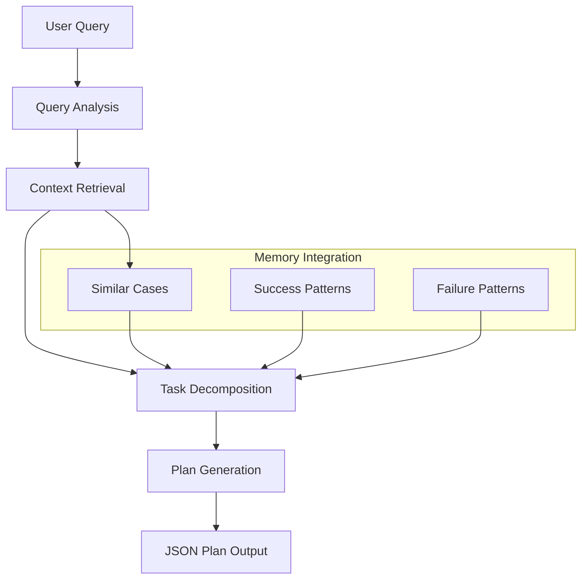
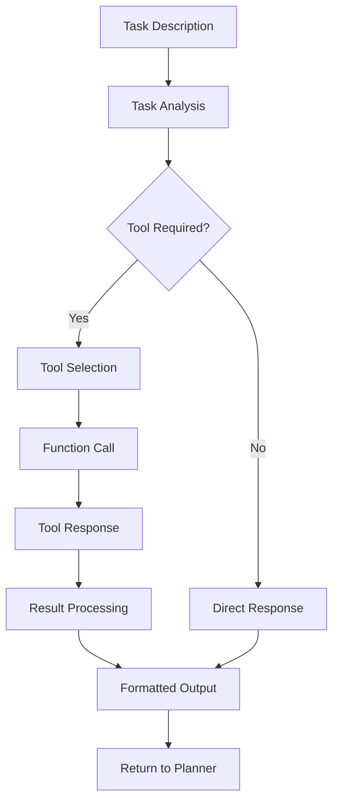
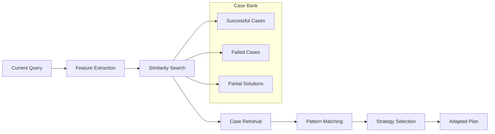

# Memento: Workflow Deep Dive

## 🔄 Complete Process Flow Analysis

This document provides a detailed breakdown of how Memento processes queries from input to output, including the internal mechanisms and decision points.

---

## 🎯 Overview: The Two-Stage Architecture

Memento operates on a **Planner-Executor** architecture where:

1. **Meta-Planner** (GPT-4.1): Strategic thinking and task decomposition
2. **Executor** (o3): Tactical execution and tool orchestration

This separation allows for:
- **Strategic Planning**: High-level reasoning about problem structure
- **Tactical Execution**: Detailed tool usage and result processing
- **Memory Integration**: Learning from both planning and execution experiences

---

## 📋 Stage 1: Meta-Planning Phase

### Input Processing



### Meta-Planner System Prompt Analysis

The meta-planner receives a carefully crafted system prompt:

```
You are the META‑PLANNER in a hierarchical AI system. A user will ask a
high‑level question. **First**: break the problem into a *minimal sequence*
of executable tasks. Reply ONLY in JSON with the schema:
{ "plan": [ {"id": INT, "description": STRING} … ] }
```

**Key Design Decisions:**
- **JSON-only output**: Ensures structured, parseable responses
- **Minimal sequence**: Prevents over-decomposition
- **Executable tasks**: Each task must be actionable by the executor

### Planning Strategies

#### 1. Sequential Decomposition
```json
{
  "plan": [
    {"id": 1, "description": "Search for information about topic X"},
    {"id": 2, "description": "Analyze the search results"},
    {"id": 3, "description": "Generate summary based on analysis"}
  ]
}
```

#### 2. Parallel-Ready Tasks
```json
{
  "plan": [
    {"id": 1, "description": "Search academic papers on topic X"},
    {"id": 2, "description": "Search news articles on topic X"},
    {"id": 3, "description": "Combine and analyze both sources"}
  ]
}
```

#### 3. Iterative Refinement
```json
{
  "plan": [
    {"id": 1, "description": "Initial exploration of the problem"},
    {"id": 2, "description": "Based on findings, deep dive into specific aspect"},
    {"id": 3, "description": "Validate findings with additional research"}
  ]
}
```

---

## ⚡ Stage 2: Execution Phase

### Executor System Prompt

```
You are the EXECUTOR sub-agent. You receive one task description at a time
from the meta-planner. Your job is to complete the task, using available
tools via function calling if needed. Always think step by step but reply
with the minimal content needed for the meta-planner.
```

### Tool Selection Process



### Available Tool Categories

#### 1. Information Gathering
- **Web Search** (`search_tool.py`): SearxNG-powered web search
- **Document Processing** (`documents_tool.py`): PDF, DOCX, PPTX extraction
- **Web Crawling** (`craw_page.py`, `ai_crawl.py`): Targeted content extraction

#### 2. Data Processing
- **Code Execution** (`code_agent.py`): Python script execution
- **Excel Processing** (`excel_tool.py`): Spreadsheet analysis
- **Mathematical Computation** (`math_tool.py`): Complex calculations

#### 3. Media Analysis
- **Image Processing** (`image_tool.py`): Image analysis and captioning
- **Video Processing** (`video_tool.py`): Video analysis and narration

---

## 🔄 Detailed Workflow Examples

### Example 1: Research Query Workflow

**Query**: "What are the latest AI breakthroughs in 2024?"

#### Planning Phase
```json
{
  "plan": [
    {"id": 1, "description": "Search for recent AI breakthroughs in 2024"},
    {"id": 2, "description": "Search for AI research papers published in 2024"},
    {"id": 3, "description": "Analyze and categorize the findings"},
    {"id": 4, "description": "Synthesize into comprehensive summary"}
  ]
}
```

#### Execution Flow

**Task 1 Execution:**
```python
# Executor receives: "Search for recent AI breakthroughs in 2024"
# Tool selection: search_tool
await search_tool.search(
    query="AI breakthroughs 2024 artificial intelligence",
    num_results=10,
    category="general",
    time_range="year"
)
```

**Task 1 Result:**
```
Found 10 relevant articles about AI breakthroughs in 2024:
1. GPT-4 Vision capabilities announced
2. Google's Gemini Ultra performance benchmarks
3. OpenAI's Sora video generation model
4. Advances in robotics with Boston Dynamics
...
```

**Task 2 Execution:**
```python
# Executor receives: "Search for AI research papers published in 2024"
await search_tool.search(
    query="AI research papers 2024 arxiv machine learning",
    num_results=15,
    category="science"
)
```

**Back to Planner:**
The meta-planner receives both results and continues with tasks 3 and 4, synthesizing the information.

### Example 2: Data Analysis Workflow

**Query**: "Analyze this sales data and create visualizations"

#### Planning Phase
```json
{
  "plan": [
    {"id": 1, "description": "Examine the structure of the sales data"},
    {"id": 2, "description": "Perform exploratory data analysis"},
    {"id": 3, "description": "Create relevant visualizations"},
    {"id": 4, "description": "Generate insights and recommendations"}
  ]
}
```

#### Execution Flow

**Task 1 Execution:**
```python
# Tool: excel_tool or code_agent depending on format
await code_agent.read_workspace_file("sales_data.csv")
```

**Task 2 Execution:**
```python
# Tool: code_agent
await code_agent.write_workspace_file(
    "analysis.py",
    """
import pandas as pd
import numpy as np

# Load and analyze data
df = pd.read_csv('sales_data.csv')
print(df.describe())
print(df.info())
"""
)
await code_agent.execute_terminal_command("python analysis.py")
```

**Task 3 Execution:**
```python
# Tool: code_agent
await code_agent.write_workspace_file(
    "visualizations.py",
    """
import matplotlib.pyplot as plt
import seaborn as sns

# Create visualizations
plt.figure(figsize=(12, 8))
# ... visualization code ...
plt.savefig('sales_analysis.png')
"""
)
await code_agent.execute_terminal_command("python visualizations.py")
```

---

## 🧠 Memory Integration (Future Implementation)

### Case-Based Reasoning Process



### Experience Storage Format

```python
class Experience:
    def __init__(self):
        self.state = {
            "query_type": "research",
            "domain": "technology",
            "complexity": "medium",
            "tools_required": ["search", "analysis"]
        }
        self.action = {
            "plan": [
                {"id": 1, "description": "...", "tool": "search"},
                {"id": 2, "description": "...", "tool": "analysis"}
            ]
        }
        self.reward = {
            "success": True,
            "quality_score": 0.85,
            "efficiency": 0.92,
            "user_satisfaction": 0.88
        }
```

### Retrieval Strategy

```python
def retrieve_similar_cases(current_state, k=4):
    """
    Retrieve k most similar cases based on:
    - Query similarity (semantic)
    - Domain relevance
    - Tool requirements
    - Success probability
    """
    similarities = compute_similarities(current_state, case_bank)
    return case_bank[similarities.argsort()[-k:]]
```

---

## 🔧 Error Handling and Recovery

### Planning Phase Errors

```python
async def handle_planning_error(query, error):
    if "JSON parsing" in str(error):
        # Retry with more explicit JSON instructions
        return await retry_planning_with_json_emphasis(query)
    elif "context too long" in str(error):
        # Truncate context and retry
        return await planning_with_truncated_context(query)
    else:
        # Fallback to simpler planning
        return await simple_fallback_plan(query)
```

### Execution Phase Errors

```python
async def handle_execution_error(task, error):
    if "tool not available" in str(error):
        # Try alternative tool
        return await execute_with_alternative_tool(task)
    elif "rate limit" in str(error):
        # Wait and retry
        await asyncio.sleep(60)
        return await retry_execution(task)
    else:
        # Report failure to planner
        return f"Task failed: {error}"
```

---

## 📊 Performance Metrics

### Planning Efficiency

```python
def measure_planning_quality(plan, execution_results):
    return {
        "task_count": len(plan.tasks),
        "success_rate": sum(r.success for r in execution_results) / len(plan.tasks),
        "redundancy": calculate_redundancy(plan.tasks),
        "completeness": assess_completeness(plan, final_result)
    }
```

### Execution Efficiency

```python
def measure_execution_quality(task, result):
    return {
        "tool_selection_accuracy": assess_tool_choice(task, result),
        "result_quality": evaluate_result_quality(result),
        "resource_usage": measure_resource_consumption(task),
        "error_rate": count_errors_during_execution(task)
    }
```

---

## 🚀 Optimization Strategies

### Context Window Management

```python
def optimize_context(messages, max_tokens=175000):
    """
    Intelligent context truncation:
    1. Keep system prompts
    2. Preserve recent interactions
    3. Summarize older context
    4. Maintain critical information
    """
    token_count = count_tokens(messages)
    if token_count <= max_tokens:
        return messages
    
    return truncate_intelligently(messages, max_tokens)
```

### Parallel Execution

```python
async def parallel_execution_when_possible(tasks):
    """
    Identify independent tasks and execute in parallel
    """
    independent_groups = identify_independent_tasks(tasks)
    results = []
    
    for group in independent_groups:
        if len(group) > 1:
            # Execute in parallel
            group_results = await asyncio.gather(
                *[execute_task(task) for task in group]
            )
        else:
            # Execute sequentially
            group_results = [await execute_task(group[0])]
        
        results.extend(group_results)
    
    return results
```

### Caching Strategy

```python
class ResultCache:
    def __init__(self):
        self.cache = {}
        self.ttl = {}  # Time-to-live for each cached result
    
    def get(self, query_hash):
        if query_hash in self.cache and not self.is_expired(query_hash):
            return self.cache[query_hash]
        return None
    
    def set(self, query_hash, result, ttl_seconds=3600):
        self.cache[query_hash] = result
        self.ttl[query_hash] = time.time() + ttl_seconds
```

---

## 🎯 Future Enhancements

### Adaptive Planning

```python
class AdaptivePlanner:
    def __init__(self):
        self.success_patterns = {}
        self.failure_patterns = {}
    
    async def generate_adaptive_plan(self, query):
        # Learn from past successes and failures
        similar_cases = self.retrieve_similar_cases(query)
        success_rate = self.calculate_success_rate(similar_cases)
        
        if success_rate > 0.8:
            # Use proven strategy
            return self.adapt_successful_strategy(query, similar_cases)
        else:
            # Try novel approach
            return await self.generate_novel_strategy(query)
```

### Multi-Modal Integration

```python
class MultiModalExecutor:
    async def execute_multimodal_task(self, task):
        modalities = self.detect_modalities(task)
        
        results = {}
        if 'text' in modalities:
            results['text'] = await self.process_text(task)
        if 'image' in modalities:
            results['image'] = await self.process_image(task)
        if 'audio' in modalities:
            results['audio'] = await self.process_audio(task)
        
        return self.synthesize_multimodal_results(results)
```

---

## 📈 Monitoring and Analytics

### Real-time Metrics

```python
class WorkflowMonitor:
    def __init__(self):
        self.metrics = {
            "queries_processed": 0,
            "average_planning_time": 0,
            "average_execution_time": 0,
            "success_rate": 0,
            "tool_usage_stats": {},
            "error_rates": {}
        }
    
    async def log_workflow_step(self, step_type, duration, success, details):
        # Update metrics in real-time
        self.update_metrics(step_type, duration, success, details)
        
        # Send to monitoring system
        await self.send_to_monitoring(step_type, duration, success, details)
```

---

This deep dive into Memento's workflow reveals the sophisticated orchestration between planning and execution, with built-in error handling, optimization strategies, and future enhancements for memory-based learning. The architecture's modularity allows for continuous improvement and adaptation to new use cases.

---

*For implementation details, refer to the source code in the [Memento repository](https://github.com/Agent-on-the-Fly/Memento)* 