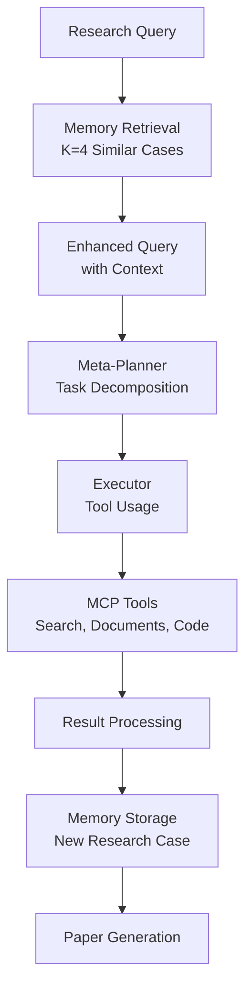

# 🔬 Memento Library Research Paper Generator

> **Using Memento as a Library for Academic Research Paper Generation**

This project demonstrates how to use the [Memento framework](https://github.com/Agent-on-the-Fly/Memento) as a library to create a specialized research paper generation agent that combines Memento's hierarchical architecture with memory-based learning.

## 🏗️ Architecture Overview

### **Memento Components Used:**
- **HierarchicalClient**: Meta-Planner + Executor architecture
- **OpenAIBackend**: LLM integration with retry logic
- **MCP Tools**: Modular tool integration via FastMCP servers
- **Memory System**: Enhanced case-based reasoning for research

### **Research-Specific Enhancements:**
- **ResearchCase**: Structured storage of research experiences
- **MementoMemorySystem**: K=4 optimal case retrieval
- **Academic Prompts**: Research-focused system prompts
- **Tool Integration**: Search, document processing, LaTeX generation

## 📋 Project Structure

```
📁 Agent_Fly/
├── 📁 Memento/                           # Cloned Memento repository
│   ├── 📁 client/
│   │   └── agent.py                      # HierarchicalClient
│   └── 📁 server/
│       ├── search_tool.py                # Web search via SearxNG
│       ├── documents_tool.py             # PDF/document processing
│       ├── code_agent.py                 # Code generation & LaTeX
│       └── ...                          # Other MCP tools
├── 🐍 memento_library_research_agent.py  # Main research agent
├── 🔧 setup_memento_library.py          # Setup script
├── 📖 README_Memento_Library_Usage.md   # This file
├── 🗃️ memento_research_memory.json      # Research case memory
└── 📁 memento_research_outputs/          # Generated papers
```

## 🚀 Quick Start

### **1. Prerequisites**
- Python 3.9+
- Memento repository cloned
- OpenAI API key

### **2. Setup**
```bash
# Run the setup script
python setup_memento_library.py

# Update .env with your API key
# Edit .env file and add: OPENAI_API_KEY=your_key_here
```

### **3. Usage**
```bash
# Interactive mode
python memento_library_research_agent.py

# Or run examples
python example_memento_usage.py
```

## 🔧 How It Works

### **1. Import Memento Components**
```python
# Add Memento to Python path
sys.path.insert(0, str(MEMENTO_PATH / "client"))
sys.path.insert(0, str(MEMENTO_PATH / "server"))

# Import Memento components
from agent import HierarchicalClient, OpenAIBackend
```

### **2. Initialize Research Agent**
```python
class MementoResearchAgent:
    def __init__(self):
        # Initialize memory system
        self.memory = MementoMemorySystem()
        
        # Initialize Memento client
        self.client = HierarchicalClient("gpt-4.1", "o3-2025-04-16")
        
        # Connect to MCP servers
        server_scripts = [
            "Memento/server/search_tool.py",
            "Memento/server/documents_tool.py", 
            "Memento/server/code_agent.py",
            # ... other tools
        ]
```

### **3. Memory-Based Research Process**


## 🛠️ Key Features

### **Memory-Based Learning**
```python
@dataclass
class ResearchCase:
    query: str
    domain: str
    approach: str
    tools_used: List[str]
    success_metrics: Dict[str, float]
    insights: List[str]
    timestamp: datetime
    task_complexity: int
    final_result: str
```

### **Hierarchical Processing**
- **Meta-Planner**: Breaks research into executable tasks
- **Executor**: Uses MCP tools to complete tasks
- **Memory Integration**: Learns from each research session

### **MCP Tool Integration**
- **search_tool.py**: Web search via SearxNG
- **documents_tool.py**: PDF extraction and processing
- **code_agent.py**: LaTeX generation and formatting
- **excel_tool.py**: Data analysis and tables
- **image_tool.py**: Figure processing
- **math_tool.py**: Mathematical equations

## 📊 Usage Examples

### **1. Single Research Query**
```python
agent = MementoResearchAgent()

result = await agent.generate_research_paper(
    research_query="Transformer architectures for multimodal learning",
    domain="machine learning"
)

if result["success"]:
    print(f"Paper saved to: {result['result_file']}")
    print(f"Tools used: {result['tools_used']}")
```

### **2. Interactive Research Session**
```python
agent = MementoResearchAgent()
await agent.interactive_research_session()

# Prompts for:
# - Research topic
# - Domain
# - Shows memory usage
# - Displays results
```

### **3. Batch Research Processing**
```python
queries = [
    {"query": "Quantum error correction", "domain": "quantum computing"},
    {"query": "Blockchain consensus", "domain": "distributed systems"},
    {"query": "Neural architecture search", "domain": "machine learning"}
]

for query_info in queries:
    result = await agent.generate_research_paper(**query_info)
    # Process results...
```

## 🎯 Research Process Flow

### **Step 1: Memory Retrieval**
```python
# Retrieve similar research cases
similar_cases = self.memory.retrieve_similar_cases(query, domain, k=4)

# Add memory context to query
memory_context = "Previous research experience context:\n"
for case in similar_cases:
    memory_context += f"- {case.query} in {case.domain}\n"
    memory_context += f"  Success: {case.success_metrics}\n"
```

### **Step 2: Hierarchical Processing**
```python
# Enhanced query with memory context
enhanced_query = f"""
Research Topic: {research_query}
Domain: {domain}
{memory_context}

Requirements:
1. Literature review using search tools
2. Document analysis and extraction
3. Research gap identification
4. LaTeX paper generation
"""

# Process via Memento's hierarchical system
result = await self.client.process_query(enhanced_query, file_path, task_id)
```

### **Step 3: Memory Storage**
```python
# Create research case
research_case = ResearchCase(
    query=research_query,
    domain=domain,
    tools_used=extracted_tools,
    success_metrics=calculated_metrics,
    insights=extracted_insights,
    timestamp=datetime.now(),
    # ... other fields
)

# Store for future use
self.memory.store_case(research_case)
```

## 🔍 Memory System Details

### **Case Retrieval Algorithm**
```python
def retrieve_similar_cases(self, query: str, domain: str, k: int = 4):
    query_words = set(query.lower().split())
    domain_words = set(domain.lower().split())
    
    scored_cases = []
    for case in self.cases:
        # Calculate similarity scores
        query_similarity = jaccard_similarity(query_words, case_words)
        domain_similarity = jaccard_similarity(domain_words, case_domain_words)
        
        # Combined similarity (70% query, 30% domain)
        similarity = 0.7 * query_similarity + 0.3 * domain_similarity
        scored_cases.append((similarity, case))
    
    # Return top K cases (Memento optimal K=4)
    return [case for _, case in sorted(scored_cases, reverse=True)[:k]]
```

### **Success Metrics**
```python
success_metrics = {
    "completion_score": 1.0 if "FINAL ANSWER:" in result else 0.7,
    "tools_utilization": min(1.0, len(tools_used) / 3.0),
    "content_length": min(1.0, len(result) / 5000.0),
    "academic_quality": calculated_quality_score
}
```

## 📈 Performance Benefits

### **Memory-Based Learning**
- **No Model Retraining**: Learns from experiences, not gradients
- **Fast Adaptation**: Immediate improvement from stored cases
- **Domain Transfer**: Knowledge transfers across research domains
- **Continuous Improvement**: Gets better with each research session

### **Hierarchical Architecture**
- **Strategic Planning**: Meta-planner creates optimal task sequences
- **Efficient Execution**: Executor uses appropriate tools for each task
- **Error Recovery**: Retry logic and fallback strategies
- **Scalable Processing**: Handles complex, multi-step research tasks

## 🔧 Configuration Options

### **Model Selection**
```python
agent = MementoResearchAgent(
    meta_model="gpt-4.1",        # Strategic planning
    exec_model="o3-2025-04-16",  # Task execution
)
```

### **Tool Configuration**
```python
server_scripts = [
    "Memento/server/search_tool.py",      # Required: Web search
    "Memento/server/documents_tool.py",   # Required: PDF processing
    "Memento/server/code_agent.py",       # Required: LaTeX generation
    "Memento/server/excel_tool.py",       # Optional: Data analysis
    "Memento/server/image_tool.py",       # Optional: Figure processing
    "Memento/server/math_tool.py",        # Optional: Math equations
]
```

### **Memory Settings**
```python
memory = MementoMemorySystem(
    storage_path="custom_memory.json",
    k_similar_cases=4,  # Memento optimal
    similarity_threshold=0.3
)
```

## 🚨 Troubleshooting

### **Common Issues**

**1. Import Errors**
```bash
❌ ImportError: No module named 'agent'
```
*Solution: Run `python setup_memento_library.py` to configure paths*

**2. MCP Server Connection**
```bash
❌ RuntimeError: Failed to connect to MCP server
```
*Solution: Check that Memento server scripts exist and are executable*

**3. API Key Issues**
```bash
❌ OpenAI API key not configured
```
*Solution: Update .env file with valid OPENAI_API_KEY*

**4. Memory File Corruption**
```bash
❌ Error loading cases: Invalid JSON
```
*Solution: Delete `memento_research_memory.json` to reset memory*

### **Performance Optimization**

**For Faster Research:**
- Use `gpt-3.5-turbo` for meta-planner
- Reduce number of MCP tools
- Set lower memory retrieval K value

**For Higher Quality:**
- Use `gpt-4.1` for both planner and executor
- Enable all MCP tools
- Increase memory context window

## 🔮 Advanced Usage

### **Custom Tool Integration**
```python
# Add custom MCP server
custom_tools = [
    "path/to/custom_research_tool.py",
    "path/to/citation_manager.py"
]

agent = MementoResearchAgent(server_scripts=default_tools + custom_tools)
```

### **Domain-Specific Agents**
```python
# Create specialized agents for different domains
ml_agent = MementoResearchAgent()
ml_agent.memory = MementoMemorySystem("ml_research_memory.json")

physics_agent = MementoResearchAgent() 
physics_agent.memory = MementoMemorySystem("physics_research_memory.json")
```

### **Batch Processing**
```python
async def batch_research(queries: List[Dict]):
    agent = MementoResearchAgent()
    results = []
    
    for query_info in queries:
        result = await agent.generate_research_paper(**query_info)
        results.append(result)
        
        # Add delay to respect rate limits
        await asyncio.sleep(30)
    
    return results
```

## 📊 Output Examples

### **Generated Files**
```
📁 memento_research_outputs/
├── research_paper_20240115_143022.md    # Full research paper
├── research_paper_20240115_143022.tex   # LaTeX source (if generated)
└── research_paper_20240115_143022.pdf   # PDF output (if compiled)
```

### **Memory Storage**
```json
{
  "query": "Transformer architectures for multimodal learning",
  "domain": "machine learning", 
  "tools_used": ["search", "document_processing", "code_agent"],
  "success_metrics": {
    "completion_score": 1.0,
    "tools_utilization": 1.0,
    "content_length": 0.95,
    "academic_quality": 0.85
  },
  "insights": [
    "Identified research gaps",
    "Novel contributions identified", 
    "LaTeX formatting applied"
  ]
}
```

## 🤝 Contributing

### **Adding New Research Tools**
1. Create MCP server following Memento patterns
2. Add to server_scripts list
3. Update research prompts if needed
4. Test with example queries

### **Enhancing Memory System**
1. Extend ResearchCase dataclass
2. Improve similarity algorithms
3. Add domain-specific retrieval
4. Implement quality assessment

### **Improving Academic Quality**
1. Add citation verification
2. Implement peer review simulation
3. Enhance LaTeX formatting
4. Add figure/table generation

## 📝 License & Credits

This project builds upon:
- **[Memento Framework](https://github.com/Agent-on-the-Fly/Memento)**: Hierarchical agent architecture
- **FastMCP**: Tool integration framework
- **OpenAI**: LLM capabilities

## 🎉 Get Started Today!

```bash
# 1. Setup
python setup_memento_library.py

# 2. Configure API key in .env
OPENAI_API_KEY=your_key_here

# 3. Run research agent
python memento_library_research_agent.py

# 4. Choose option 1 for interactive mode
# 5. Enter your research topic and domain
# 6. Watch Memento generate your research paper!
```

**Transform your research workflow with Memento's memory-based learning! 🔬📚**

---

*Built with ❤️ using Memento's Hierarchical Architecture and Memory-Based Learning* 