# 🔬 Memento AI Research Paper Generator

> **Revolutionary AI Research Agent combining Memento Architecture with LangGraph**

An autonomous research paper generator that learns from experience without updating model weights, using memory-based learning and multi-agent workflows.

## 🌟 Key Features

### 🧠 Memento Architecture
- **Memory-Based Learning**: Stores research experiences in a "Case Bank"
- **No Weight Updates**: Learns without expensive model retraining
- **Case-Based Reasoning**: Retrieves similar past experiences (K=4 optimal)
- **Continuous Improvement**: Gets better with each research session

### 🔄 LangGraph Multi-Agent System
- **Meta-Planner**: Strategic research planning (GPT-4 equivalent)
- **Memory Retriever**: Accesses past research experiences
- **Data Collector**: Multi-source information gathering
- **Analyzer**: Synthesizes collected information
- **Paper Generator**: Creates structured academic papers
- **Experience Updater**: Stores new learning experiences

### 🔍 Research Capabilities
- **Web Search**: DuckDuckGo integration
- **Academic Papers**: ArXiv and scholarly article search
- **Web Scraping**: Intelligent content extraction
- **Multi-Source Analysis**: Comprehensive data synthesis
- **Citation Generation**: Proper academic referencing

## 🚀 Quick Start

### Prerequisites
- Python 3.9+
- OpenAI API key
- Internet connection

### Installation

1. **Setup Environment:**
   ```bash
   python -m venv memento_research_env
   source memento_research_env/bin/activate  # On Windows: memento_research_env\Scripts\activate
   ```

2. **Install Dependencies:**
   ```bash
   pip install -r requirements_research_agent.txt
   ```

3. **Configure API Keys:**
   Create a `.env` file:
   ```env
   OPENAI_API_KEY=your_openai_api_key_here
   ```

4. **Run the Agent:**
   ```bash
   python memento_research_paper_generator.py
   ```

## 📋 Project Files

```
📁 Memento Research Agent/
├── 🐍 memento_research_paper_generator.py  # Main agent implementation
├── 📋 requirements_research_agent.txt      # Dependencies
├── 📖 setup_research_agent.md             # Detailed setup guide
├── 🔧 example_usage.py                    # Usage examples
├── 📚 README_Memento_Research_Agent.md    # This file
├── 🗃️ memento_case_bank.json             # Memory bank (auto-generated)
└── 📁 research_outputs/                   # Generated papers (auto-created)
    ├── research_paper_YYYYMMDD_HHMMSS.md
    └── research_analysis_YYYYMMDD_HHMMSS.md
```

## 🎯 Usage Examples

### Interactive Mode
```bash
python memento_research_paper_generator.py
```

### Programmatic Usage
```python
from memento_research_paper_generator import MementoResearchAgent
import asyncio

async def research_example():
    agent = MementoResearchAgent(openai_api_key)
    result = await agent.generate_research_paper(
        "Latest developments in transformer architectures for NLP"
    )
    print(f"Paper saved to: {result['paper_file']}")

asyncio.run(research_example())
```

### Example Research Queries

**AI/ML Topics:**
- "Applications of reinforcement learning in autonomous vehicles"
- "Ethical considerations in AI decision-making systems"
- "Federated learning for privacy-preserving healthcare AI"

**Technology Topics:**
- "Blockchain applications in supply chain transparency"
- "Quantum computing impact on cybersecurity"
- "Edge computing optimization for IoT networks"

**Healthcare Topics:**
- "AI-powered drug discovery acceleration methods"
- "Telemedicine adoption patterns post-pandemic"
- "Machine learning in personalized medicine"

## 🏗️ Architecture Deep Dive

### Memento Memory System


### LangGraph Workflow

```mermaid
graph TD
    A[🧠 Meta-Planner<br/>Strategic Planning] --> B[🗃️ Memory Retriever<br/>Past Experiences]
    B --> C[🔍 Data Collector<br/>Multi-Source Gathering]
    C --> D[📊 Analyzer<br/>Information Synthesis]
    D --> E[📝 Paper Generator<br/>Academic Writing]
    E --> F[💾 Experience Updater<br/>Memory Storage]
    F --> G[✅ Complete]
    
    style A fill:#e1f5fe
    style B fill:#f3e5f5
    style C fill:#e8f5e8
    style D fill:#fff3e0
    style E fill:#fce4ec
    style F fill:#f1f8e9
```



## 🔧 Advanced Configuration

### Memory Bank Settings
```python
# Optimal K value from Memento research
K_SIMILAR_EXPERIENCES = 4

# Experience storage parameters
MAX_EXPERIENCES = 1000
SIMILARITY_THRESHOLD = 0.3
```

### Research Parameters
```python
# Data collection limits
MAX_SEARCH_RESULTS = 5
MAX_ITERATIONS = 3
CHUNK_SIZE = 1000

# Model configuration
MODEL_NAME = "gpt-4"  # or "gpt-3.5-turbo"
TEMPERATURE = 0.1
```

### Adding Custom Research Tools

```python
@tool
def custom_database_search(self, query: str) -> str:
    """Search custom academic database"""
    # Your implementation
    return results

# Register in ResearchToolKit
toolkit.add_tool(custom_database_search)
```

## 📊 Performance Metrics

The agent tracks several success metrics:

- **Data Sources**: Number of sources consulted (target: 6+)
- **Success Score**: Quality metric (0.0-1.0, target: >0.8)
- **Paper Completeness**: Section coverage and depth
- **Memory Growth**: Experience bank expansion over time

### Sample Performance
```
✅ Research completed successfully!
📊 Data sources used: 8
🎯 Success score: 0.95
📄 Paper length: 3,247 words
💾 Memory bank: 15 experiences stored
```

## 🔄 Memory Learning Process

### 1. Experience Storage
Each research session stores:
```json
{
  "query": "AI applications in healthcare",
  "context": "Medical imaging and diagnosis focus",
  "actions_taken": ["web_search", "arxiv_search", "analysis"],
  "results": {"sources": 6, "quality": 0.9},
  "success_score": 0.9,
  "timestamp": "2024-01-15T14:30:22",
  "metadata": {
    "key_insights": ["Deep learning in radiology", "FDA approval challenges"],
    "paper_outline": "Introduction, Methods, Applications..."
  }
}
```

### 2. Experience Retrieval
- Keyword similarity matching
- Top K=4 most relevant experiences
- Contextual relevance scoring
- Strategic insight extraction

### 3. Continuous Learning
- No model retraining required
- Pattern recognition improvement
- Domain expertise accumulation
- User preference adaptation

## 🚨 Troubleshooting

### Common Issues

**API Key Errors:**
```bash
❌ Please set your OPENAI_API_KEY environment variable
```
*Solution: Add API key to `.env` file*

**Rate Limiting:**
```bash
⚠️ Rate limit exceeded, waiting...
```
*Solution: Agent includes automatic delays*

**Memory Issues:**
```bash
❌ Memory allocation error
```
*Solution: Reduce CHUNK_SIZE or MAX_SEARCH_RESULTS*

### Performance Optimization

**For Faster Research:**
- Use `gpt-3.5-turbo` instead of `gpt-4`
- Reduce `MAX_SEARCH_RESULTS` to 3
- Limit `MAX_ITERATIONS` to 2

**For Higher Quality:**
- Use `gpt-4` for all operations
- Increase `MAX_SEARCH_RESULTS` to 8
- Enable additional research tools

## 🔮 Future Enhancements

### Planned Features
- [ ] **Enhanced Similarity Matching**: Embedding-based experience retrieval
- [ ] **Multi-Language Support**: Research in multiple languages
- [ ] **Citation Verification**: Automatic fact-checking
- [ ] **Collaborative Research**: Multi-agent collaboration
- [ ] **Visual Analytics**: Research insight visualization
- [ ] **Integration APIs**: Connect with reference managers

### Research Improvements
- [ ] **Domain Specialization**: Field-specific research strategies
- [ ] **Real-time Updates**: Live data integration
- [ ] **Peer Review**: Automated quality assessment
- [ ] **Version Control**: Research iteration tracking

## 📈 Comparison with Traditional Approaches

| Feature | Traditional Fine-tuning | Memento Architecture |
|---------|------------------------|---------------------|
| **Learning Method** | Weight updates | Experience storage |
| **Computational Cost** | High (GPU required) | Low (inference only) |
| **Adaptation Speed** | Slow (hours/days) | Fast (immediate) |
| **Memory Efficiency** | Poor (catastrophic forgetting) | Excellent (persistent memory) |
| **Scalability** | Limited | High |
| **Interpretability** | Low | High (explicit experiences) |

## 🤝 Contributing

We welcome contributions! Here's how to help:

### Development Setup
```bash
git clone <repository>
cd memento-research-agent
python -m venv dev_env
source dev_env/bin/activate
pip install -r requirements_research_agent.txt
pip install -r requirements_dev.txt  # Additional dev dependencies
```

### Contribution Areas
- **New Research Tools**: Add specialized search capabilities
- **Memory Enhancements**: Improve experience retrieval algorithms
- **UI/UX**: Create web interfaces or GUI applications
- **Documentation**: Improve guides and examples
- **Testing**: Add comprehensive test suites

### Code Style
- Follow PEP 8 guidelines
- Add type hints for all functions
- Include docstrings for public methods
- Write unit tests for new features

## 📝 License

This project is licensed under the MIT License - see the [LICENSE](LICENSE) file for details.

## 🙏 Acknowledgments

This implementation combines insights from:

- **Memento Research**: Memory-based learning without weight updates
- **LangGraph Framework**: Multi-agent workflow orchestration
- **AI Research Community**: Various researcher implementation patterns
- **Academic Sources**: ArXiv, Google Scholar, and other research databases

## 📞 Support

For questions, issues, or contributions:

- 📧 **Email**: [Your contact email]
- 🐛 **Issues**: [GitHub Issues]
- 💬 **Discussions**: [GitHub Discussions]
- 📚 **Documentation**: [Wiki/Docs]

---

## 🎉 Get Started Today!

Transform your research workflow with the power of memory-based AI agents:

```bash
# Quick start in 3 commands
pip install -r requirements_research_agent.txt
echo "OPENAI_API_KEY=your_key_here" > .env
python memento_research_paper_generator.py
```

**Happy Researching! 🔬📚**

---

*Built with ❤️ using Memento Architecture and LangGraph* 