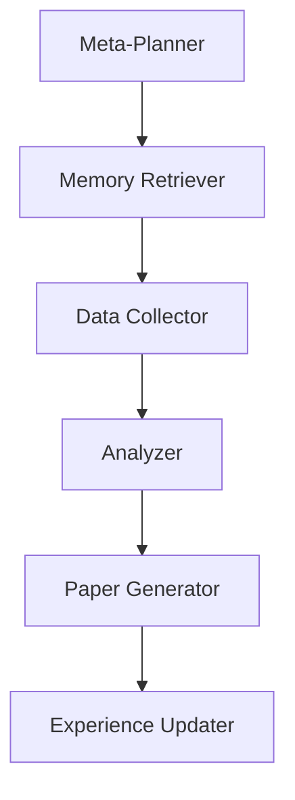

# Memento AI Research Paper Generator Setup Guide

## 🚀 Quick Start

This AI research paper generator combines the Memento architecture (memory-based learning without weight updates) with LangGraph for autonomous research paper generation.

### Prerequisites

- Python 3.9 or higher
- OpenAI API key
- Internet connection for research

### Installation

1. **Clone or download the files:**
   ```bash
   # Ensure you have these files:
   # - memento_research_paper_generator.py
   # - requirements_research_agent.txt
   # - setup_research_agent.md (this file)
   ```

2. **Create a virtual environment:**
   ```bash
   python -m venv memento_research_env
   
   # Activate on Windows:
   memento_research_env\Scripts\activate
   
   # Activate on macOS/Linux:
   source memento_research_env/bin/activate
   ```

3. **Install dependencies:**
   ```bash
   pip install -r requirements_research_agent.txt
   ```

4. **Set up environment variables:**
   
   Create a `.env` file in the same directory:
   ```env
   OPENAI_API_KEY=your_openai_api_key_here
   
   # Optional: For enhanced search capabilities
   SERPAPI_API_KEY=your_serpapi_key_here
   GOOGLE_API_KEY=your_google_api_key_here
   ```

### Running the Agent

```bash
python memento_research_paper_generator.py
```

## 🏗️ Architecture Overview

### Memento Components

1. **Memory Bank**: Stores research experiences without updating model weights
2. **Case-Based Reasoning**: Retrieves similar past research experiences (K=4 optimal)
3. **Experience Storage**: Learns from each research session

### LangGraph Workflow



### Agent Roles

- **Meta-Planner**: Strategic research planning (GPT-4 equivalent)
- **Memory Retriever**: Accesses past research experiences
- **Data Collector**: Gathers data from multiple sources (Executor equivalent)
- **Analyzer**: Synthesizes collected information
- **Paper Generator**: Creates structured academic papers
- **Experience Updater**: Stores new experiences in memory bank

## 🔧 Features

### Research Capabilities

- **Multi-Source Data Collection**:
  - Web search (DuckDuckGo)
  - Academic papers (ArXiv)
  - Scholarly articles
  - Web scraping

- **Memory-Based Learning**:
  - Stores successful research patterns
  - Retrieves similar past experiences
  - Improves over time without retraining

- **Comprehensive Paper Generation**:
  - Structured academic format
  - Literature review
  - Analysis and findings
  - Proper citations

### Output Files

The agent generates:
- `research_paper_YYYYMMDD_HHMMSS.md`: Complete research paper
- `research_analysis_YYYYMMDD_HHMMSS.md`: Detailed analysis and insights
- `memento_case_bank.json`: Memory bank of experiences

## 🎯 Usage Examples

### Example Research Queries

1. **AI/ML Topics**:
   - "Latest developments in transformer architectures for NLP"
   - "Applications of reinforcement learning in robotics"
   - "Ethical considerations in AI decision-making systems"

2. **Technology Topics**:
   - "Blockchain applications in supply chain management"
   - "Quantum computing impact on cryptography"
   - "Edge computing for IoT applications"

3. **Healthcare Topics**:
   - "AI applications in medical imaging diagnosis"
   - "Telemedicine adoption post-COVID-19"
   - "Machine learning in drug discovery"

### Sample Interaction

```
🔍 Enter your research query: Latest developments in transformer architectures for natural language processing

🚀 Generating research paper for: Latest developments in transformer architectures for natural language processing
This may take a few minutes...

🧠 Meta-Planner: Analyzing research query and creating plan
🗃️ Memory Retriever: Searching for similar research experiences
🔍 Data Collector: Gathering research data
📊 Analyzer: Analyzing collected research data
📝 Paper Generator: Creating research paper
💾 Experience Updater: Storing research experience

✅ Research paper generated successfully!
📊 Data sources used: 6
🎯 Success score: 1.00
📄 Paper saved to: research_outputs/research_paper_20240115_143022.md
📊 Analysis saved to: research_outputs/research_analysis_20240115_143022.md
```

## 🔄 How Memory Learning Works

### Experience Storage
Each research session stores:
- Original query
- Research plan and context
- Actions taken
- Results quality
- Success score
- Key insights

### Experience Retrieval
- Uses keyword similarity matching
- Retrieves top K=4 similar experiences (Memento optimal)
- Informs current research strategy
- Improves research quality over time

### Continuous Learning
- No model weight updates required
- Learns from research patterns
- Adapts to user preferences
- Builds domain expertise

## ⚙️ Configuration Options

### Customizing the Agent

You can modify these parameters in the code:

```python
# Memory Bank Settings
K_SIMILAR_EXPERIENCES = 4  # Memento optimal value

# Research Settings
MAX_ITERATIONS = 3
MAX_SEARCH_RESULTS = 5
CHUNK_SIZE = 1000

# Model Settings
MODEL_NAME = "gpt-4"  # or "gpt-3.5-turbo" for faster/cheaper
TEMPERATURE = 0.1
```

### Adding New Research Tools

To add new research capabilities:

```python
@tool
def custom_search_tool(self, query: str) -> str:
    """Your custom research tool"""
    # Implementation here
    return results
```

## 🚨 Troubleshooting

### Common Issues

1. **OpenAI API Key Error**:
   ```
   ❌ Please set your OPENAI_API_KEY environment variable
   ```
   Solution: Add your OpenAI API key to the `.env` file

2. **Rate Limiting**:
   - The agent includes delays between API calls
   - Reduce `MAX_SEARCH_RESULTS` if hitting limits

3. **Memory Issues**:
   - Large research papers may consume significant memory
   - Reduce `CHUNK_SIZE` if needed

4. **Network Timeouts**:
   - Check internet connection
   - Some research sources may be temporarily unavailable

### Performance Optimization

- Use `gpt-3.5-turbo` for faster, cheaper research
- Reduce search result limits for quicker processing
- Enable only necessary research tools

## 📊 Success Metrics

The agent tracks:
- **Data Sources**: Number of sources consulted
- **Success Score**: Quality metric (0.0-1.0)
- **Paper Length**: Comprehensiveness indicator
- **Experience Growth**: Memory bank expansion

## 🔮 Future Enhancements

Planned improvements:
- Enhanced similarity matching with embeddings
- Multi-language research support
- Citation verification
- Collaborative research workflows
- Integration with reference managers

## 📝 License and Credits

This implementation combines:
- **Memento Architecture**: Memory-based learning approach
- **LangGraph**: Multi-agent workflow framework
- **Research Patterns**: Inspired by various AI researcher implementations

## 🤝 Contributing

To contribute:
1. Fork the repository
2. Add new research tools or improve existing ones
3. Enhance the memory retrieval system
4. Submit pull requests with improvements

---

**Happy Researching! 🔬📚** 